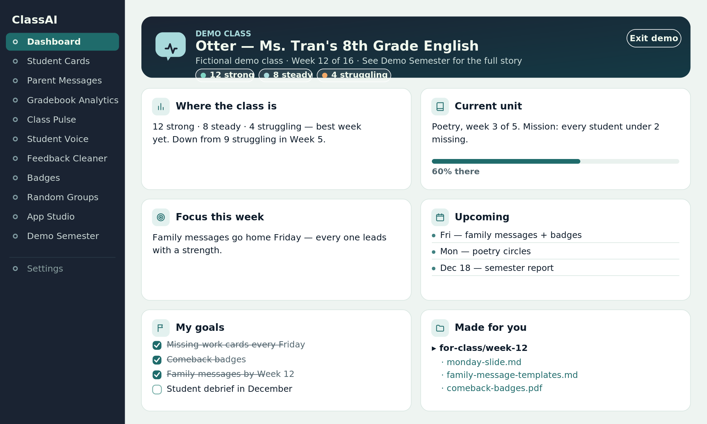
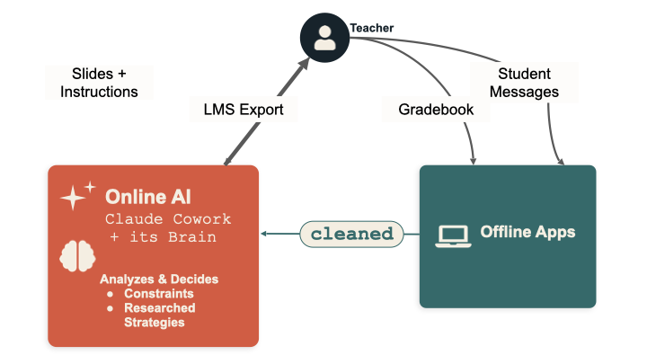
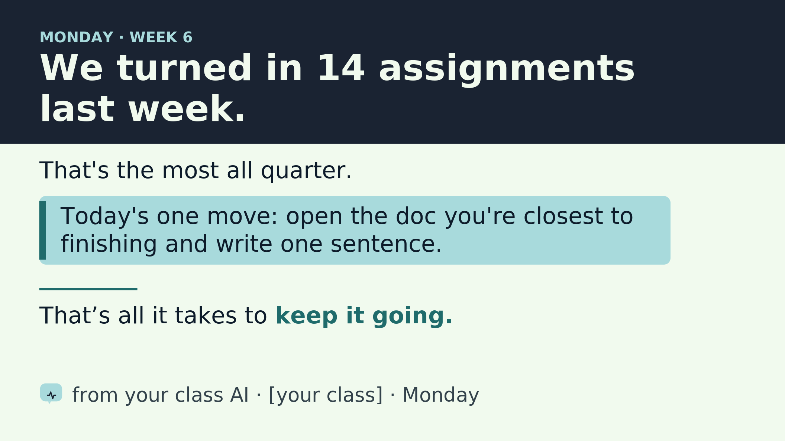

<div align="center">

# My Classroom Assistant

### A semi-autonomous AI assistant for your classroom, aimed at one problem — it plans from evidence and your classroom data, and adapts as your students weigh in.

**[🌊 Try it live at myclassroomassistant.com →](https://myclassroomassistant.com)**

</div>

**[▶️ Watch the demo video →](https://youtu.be/elIm51c1AZQ)**

It drafts your slides, your parent messages, and your encouragement cards, and adjusts what it makes as the class changes. Your gradebook never leaves your laptop — the AI works for your class without ever seeing your students' data.

## Contents

- [What it is](#what-it-is)
- [How it works](#how-it-works)
- [See it in 90 seconds](#see-it-in-90-seconds)
- [What your students decide](#what-your-students-decide)
- [Where it came from](#where-it-came-from)
- [The offline apps](#the-offline-apps)
- [What's in this folder](#whats-in-this-folder)
- [Get started](#get-started)

## What it is

My Classroom Assistant is a free, open-source project that runs inside **Claude Cowork**. It gives your class one AI that works toward a single goal you set — fewer missing assignments, better attendance, more participation — and makes the everyday materials that get you there.

Out of the box, it includes:

- **A set of offline apps** that handle everything touching student data — gradebook analysis, printable progress cards, parent messages — entirely on your laptop, with no internet connection.
- **A skill that builds more apps.** When you need a tool that doesn't exist yet, the AI writes it for you as a single offline file.
- **A research library** of evidence-based teaching practices the AI draws on, so its choices come from research, not vibes.
- **Ready-made AI personalities** your class can adopt or remix, so no one starts from a blank page.
- **A slide-design library** for the classroom projector — accessible, high-contrast openers the AI fills in.

You set it up through a short onboarding chat: the AI interviews you, and together you draft your assistant's name, personality, and mission.

<p align="center">
  
</p>

<div align="center"><sub>A teacher's home base. The AI keeps these cards current through chat — aggregate counts only, never a student's name. Press <b>See a demo class</b> to watch it fill in.</sub></div>

## How it works

The whole design rests on one rule: **the AI never sees student-identifying data.** Here's the loop.

<p align="center">
  
</p>

<div align="center"><sub>The teacher sits in the middle. Raw data goes into offline apps on your laptop; only a <b>cleaned</b>, name-free summary crosses to the AI, which sends slides and instructions back — never touching a student record.</sub></div>

1. **You stay in the middle.** Nothing passes between your students and the AI directly — you're always in between. The AI proposes; you decide; you're the one who acts in the room.

2. **Student data stays on your laptop.** Your gradebook and LMS exports go into the offline apps, which run entirely in your browser. They turn raw data into name-free, aggregate summaries — "8 students behind on Unit 3," never a list of names.

3. **Only the cleaned summary crosses the line.** You paste that aggregate into the AI, along with anonymous student messages you've already stripped of names. The AI reads the state of the class without ever seeing a student record.

4. **The AI analyzes and makes things.** Grounded in its mission, the research library, and the boundaries you've set, it drafts your slides, parent-message templates, encouragement notes, and instructions — and hands them back to you.

5. **You run it, the class moves, the aggregates come back, the AI adjusts.** That's the loop, repeating across the semester.

**It works in the real world — through you.** You tell the AI what it actually has to work with: what you can hand out, what rewards you can run, how you want it to talk to the class. In the classroom pilot, the AI organized a tea party for a class that hit its goal, ran raffles, and managed a prize box. It can't do any of that itself — it proposes, and you make it happen. That teacher-in-the-middle design is exactly what makes the real-world rewards both safe and real.

**When it needs a tool it doesn't have, it builds one** — a single offline HTML file you double-click to open. None of these tools call the internet or store student data; the AI writes the code, your browser does the data work.

**The privacy story on one page:** [`setup/permissions/privacy-one-pager.html`](setup/permissions/privacy-one-pager.html) shows exactly what crosses the line to the AI and what never does — open it, print it, hand it to your principal or a curious colleague.

## See it in 90 seconds

No setup, no real data, no account:

1. Double-click `local-tools/ClassAI-dashboard.html`.
2. Click **Progress Cards** in the sidebar, then **"Load the fictional demo class."** Print a card.
3. Click **AI Export**, load the demo class again, and generate a summary — that's the name-free aggregate the AI runs on.

That's the whole privacy architecture in your hands: real-feeling tools on your side of the line, an aggregate-only summary crossing it.

Want the long view? **Demo Semester** (in the same sidebar) shows a fictional class running this project for 16 weeks — the Cowork chats, the slump, the turnaround, and the final report.

<p align="center">
  
</p>

<div align="center"><sub>A Monday opener the AI writes, in the built-in accessible theme: big type, high contrast, one idea, no names.</sub></div>

## What your students decide

This isn't your AI — it's the class's. During setup, the students vote on:

- **The mission** — what the class works toward: missing assignments, attendance, smoother transitions, participation.
- **The name and personality** — they name it and shape how it talks. (My class named theirs **Nolan.AI**.)

From there it adapts to what the class wants — an ASL sign of the week, an Ojibwe word of the week, whatever adds a little variety. Students send anonymous messages through a Google Form; you strip any identifying info and paste the aggregate back, and the AI uses it to adjust what it proposes next.

## Where it came from

This started as an experiment in my own classroom. I gave one class's AI a single mission — reduce missing work — let the students name it (they chose **Nolan.AI**), and ran it for a semester.

> **Semester pilot — "Nolan.AI," a missing-work mission**
> Week one: missing work dropped about **12%** (8 fewer missing assignments).
> *One class · self-reported · directional, not proof.*

It was enough to convince me the idea was worth building into something other teachers could use for free.

The shape of the project is borrowed from [Anthropic's Project Vend](https://www.anthropic.com/research/project-vend-1) — the experiment where Claude was given a small business to run, with real goals, real constraints, and real autonomy. My Classroom Assistant is the classroom version of that question: **can a semi-autonomous AI, kept safely behind the teacher, help a class reach a goal it set for itself?**

To make that question answerable, the AI runs under four constraints:

1. **A personality.** Your students help name and shape the AI's voice. It's *your class's* AI, with a stake in your class's success.
2. **A clear goal.** One mission for the unit, quarter, or semester. Everything it does ladders up to that goal.
3. **Evidence-based practices.** Its defaults come from research, not vibes — and it can tell you which practice a given choice draws on.
4. **Aggregated data only.** It never sees individual student records — only summaries, tier counts, and aggregate movement. PII stays in the offline tools on your laptop.

The AI keeps a logbook (`brain/class-story.md`) so that by June, the semester reads as a story: what you tried, what moved, what you'd change.

## The offline apps

The project includes a set of small browser-based apps you use for anything that touches student data. They run entirely offline — no network calls, no cloud, no AI in the loop. Your roster and gradebook never leave your laptop. **They're safe to use with real student data.**

You open them through **Class Tools** (`local-tools/ClassAI-dashboard.html`) — double-click it once, and a sidebar lets you jump between apps.

<table>
<tr>
<td width="50%" valign="top"><br><sub><b>Progress Cards</b> — one printable card per student: missing work with checkboxes, or a full color-coded progress snapshot.</sub></td>
<td width="50%" valign="top"><br><sub><b>App Studio</b> — when the included apps don't cover it, your AI builds the next tool from a copy-paste prompt.</sub></td>
</tr>
</table>

Included today:

- **Dashboard.** Your home base. Shows your class goals, where the class is right now, and what your AI is focused on. Every other app is one click from here.

- **Progress Cards.** Print one card per student — either what they owe right now (missing work, with checkboxes) or how they're doing overall (every assignment, color-coded). Two-per-page; cut them and hand them out at the door.

- **Parent Messages.** Write one short template per tier (struggling / steady / strong) and the app mail-merges it into per-student messages with each kid's name, period, grade, and missing assignments. Paste each one into ParentSquare, email, or whatever you use to reach families.

- **Gradebook Analytics.** Drop in your gradebook and get a sortable per-student view — tiers, missing assignments, and patterns you wouldn't spot scrolling rows in PowerSchool.

- **AI Export.** A name-free summary of how the whole class is doing — counts by tier, most-missed assignments, week-over-week movement. This is what you paste to your AI so it knows the state of the class without ever seeing student records.

- **Feedback Cleaner.** Paste anonymous student feedback; it strips names and emails on your laptop and hands you a name-free digest to paste into your AI. Comes with a ready-to-use Google Form. Safe to use with real responses.

- **Badges.** Make up your own badges (Most Improved, Best Question of the Week, whatever fits your class), pick students from the roster, and print bordered certificates two-per-page.

- **Random Groups.** Generate balanced groups of any size, with a do-not-pair list (for the kids you know shouldn't be together) and pair history so the same combinations don't keep coming up.

- **App Studio.** A gallery of tools your AI can build for you — each with a ready-to-paste prompt. The starting set is just the start.

- **Demo Semester.** A fictional class running everything above for 16 weeks — Cowork chats included. Start here to see the destination.

**These tools are a starting set — your AI builds the next one.** Open **App Studio** in the sidebar for a gallery of ideas, each with a ready-to-paste prompt. When you need something the included apps don't cover, the **teacher-app-builder skill** (installable in Claude Cowork) lets the AI generate a new offline app for you. It asks a few questions, builds the HTML, runs a privacy check, and registers the new app with the Dashboard sidebar automatically. Install instructions: [docs/teacher-app-builder.md](docs/teacher-app-builder.md).

## What's in this folder

<details>
<summary><b>Full file map</b></summary>

```
MyClassroomAssistant/
├── README.md                          ← you are here
├── CLAUDE.md                          ← the first file your AI reads each session — sets the rules of the experiment
│
├── brain/                             ← the AI's character, principles, and rules — its name, voice, mission, and limits (the teacher edits these through normal chat)
│   ├── your-classroom-ai.md           ← the AI's name, voice, and current mission — the personality file
│   ├── persona-packs.md               ← 3 ready-to-remix personas + mission starters (no more blank brackets)
│   ├── teaching-principles.md         ← research-backed defaults the AI uses
│   ├── research-foundations.md        ← the research the AI cites when it explains its choices
│   ├── evidence-engine.md             ← how the AI gathers research for the class's goal, just-in-time
│   ├── evidence-packs/                ← goal-specific evidence cards the engine has built
│   ├── safety-rules.md                ← hard limits the AI follows
│   ├── weekly-rhythm.md               ← how the day, week, and month flow
│   └── class-story.md                 ← the AI's running, aggregate-only logbook of the experiment
│
├── content-templates/                 ← student-facing materials for introducing the project and running the vote
│   ├── day-one-lesson-plan.md         ← 15-minute script for introducing the AI to your class
│   ├── lms-intro-page.md              ← LMS page text explaining the project to students
│   ├── student-voting-form.md         ← co-creation vote template (Google Form or paper)
│   ├── persona-card.html              ← the "meet your AI" card — project it day one, or print and pin it
│   ├── slide-template.html            ← a real projectable opening slide in the default theme (the AI clones it)
│   ├── classroom-display-rules.md     ← design rules + the AI's default visual theme (colors, fonts, text sizes) for anything visual
│   └── app-ui-guidelines.md           ← visual standard for the teacher-facing tool pages (shared dark hero, palette, privacy invariants)
│
├── local-tools/                       ← the offline apps (see "The offline apps" section above)
│   ├── ClassAI-dashboard.html         ← home base — open this one, the sidebar gets you to every other app
│   ├── student-cards.html             ← drop in a gradebook, print per-student cards (missing work or full progress)
│   ├── parent-messages.html           ← per-tier templates, mail-merged into per-student messages to send home
│   ├── gradebook-analytics.html       ← drop in a gradebook, get a sortable per-student view with tier labels
│   ├── class-pulse.html               ← drop in a gradebook, get the aggregate-only summary you paste into your AI
│   ├── student-voice.html             ← Feedback Cleaner: paste anonymous feedback → a name-free digest (+ a ready form)
│   ├── badges.html                    ← define badges, award them, print bordered certificates
│   ├── random-groups.html             ← balanced groups with a do-not-pair list and pair-history memory
│   ├── app-studio.html                ← gallery of tools your AI can build, each with a copy-paste prompt
│   ├── demo-semester.html             ← a fictional class's full 16-week run, chats included
│   └── _nav.js                        ← shared sidebar that links every app to every other app
│
├── setup/                             ← everything you need before launching with students
│   ├── getting-started.md             ← the end-to-end setup guide — start here after this README
│   ├── crisis-card.md                 ← fill in, print, keep on your desk (emergency contacts and procedures)
│   └── permissions/
│       ├── admin-pitch.md             ← one-page pitch for your principal
│       ├── parent-letter.md           ← template letter to send families
│       ├── privacy-explainer.md       ← long-form privacy explanation for admins and district privacy officers
│       ├── privacy-one-pager.html     ← the one-page, printable "data stays in the blue box" diagram
│       └── checklist.md               ← pre-launch checklist
│
├── sandbox/
│   ├── fictional-gradebook.csv         ← 24 fake students, simple format (for trying things out)
│   └── fictional-gradebook-canvas.csv  ← 29 fake students, real Canvas LMS export format (emoji headers, points-possible row, "Last, First" names)
│
├── images/                            ← screenshots shown in this README
└── docs/
    └── teacher-app-builder.md         ← install instructions for the build-your-own-app skill
```

</details>

## Get started

The fastest taste is the [90-second tour](#see-it-in-90-seconds) above — no setup, no account, no real data.

When you're ready to go further, two more on-ramps before real students are involved:

**A full dry run of the apps (~15 minutes)**
From the Dashboard, walk through Progress Cards → AI Export → Parent Messages → Badges with the demo class (Progress Cards and AI Export have a one-click demo button; the other tools can load `sandbox/fictional-gradebook.csv`). See what each one produces side by side.

**The full experiment, end to end (~30 minutes)**
Open this folder in Claude Cowork and say hi. Run AI Export on the demo class, paste the aggregate into Cowork, and ask the AI for "Monday's opening slide." That's the loop running on a fictional class.

The complete setup walkthrough — admin permission, parent letter, day one with real students — is in [setup/getting-started.md](setup/getting-started.md).

## License

Released under the [MIT License](LICENSE) — free to use, adapt, and share, in your classroom or anyone else's.
