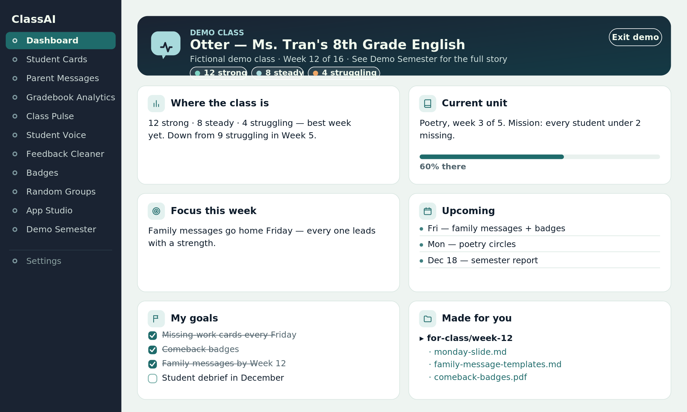
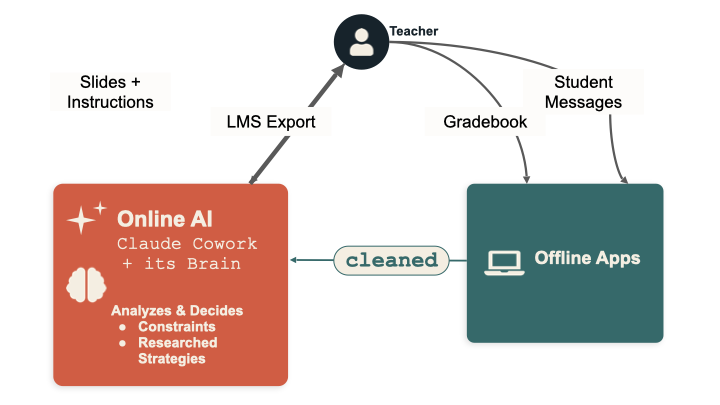
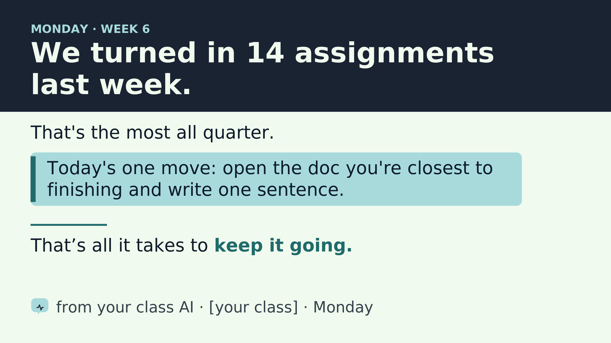

# About My Classroom Assistant

*The long version. The README is the front door — this is the room behind it: where the project came from, how the loop actually works, what each offline app does, and what's in every folder. Nothing here is required reading. Start with the [README](../README.md) and come back when you want the detail.*

---

## What it is

My Classroom Assistant is a free, open-source project that runs inside **Claude Cowork**. It gives your class one AI that works toward a single goal you set — fewer missing assignments, better attendance, more participation — and makes the everyday materials that get you there.

Out of the box, it includes:

- **A set of offline apps** that handle everything touching student data — gradebook analysis, printable progress cards, parent messages — entirely on your laptop, with no internet connection.
- **An app builder.** When you need a tool that doesn't exist yet, the AI builds one that runs on your computer and never sends anything anywhere.
- **Five ready-made challenges and the research behind them**, so the AI's suggestions come from research, not vibes — and it tells you how strong that research is.
- **Three starter personalities** (Otter, Spark, Sage) your class can adopt or remix.
- **A slide-design library** for the classroom projector — accessible, high-contrast openers the AI fills in.

You set it up in a short first chat: five quick questions, one at a time, each with an example answer. If you have to stop partway, say "let's keep going" next time.

<p align="center">
  
</p>

<div align="center"><sub>A teacher's home base. The AI keeps these cards current through chat — class totals only, never a student's name. Press <b>See a demo class</b> to watch it fill in.</sub></div>

## How it works

By default, the whole design rests on one rule: **the AI never sees student names or grades.** That's the Offline option. There's a second option, the Claude for Teachers option, only for teachers who use Claude for Teachers and whose district has given permission to share student information with it (see [the privacy explainer](../setup/permissions/privacy-explainer.md)). Here's the loop on the default option.

<p align="center">
  
</p>

<div align="center"><sub>The teacher sits in the middle. Raw data goes into offline apps on your laptop; only a <b>cleaned</b>, name-free summary crosses to the AI, which sends slides and instructions back — never touching a student record.</sub></div>

1. **You stay in the middle.** Nothing passes between your students and the AI directly — you're always in between. The AI proposes; you decide; you're the one who acts in the room.

2. **Student data stays on your laptop.** Your gradebook and the files you download from your online classroom go into the offline apps, which run entirely in your browser. They turn it into name-free class totals — "8 students behind on Unit 3," never a list of names.

3. **Only the cleaned summary crosses the line.** You paste that summary into the chat (or drop it in your pulses folder), along with anonymous student messages you've already cleaned of names. For challenges the gradebook can't count (attendance, participation, transitions, reading), you just type in your weekly count. The AI reads the state of the class without ever seeing a student record.

4. **The AI suggests one strategy and makes things.** Grounded in its mission, the research on your challenge, and the boundaries you've set, it drafts your slides, parent-message templates, encouragement notes, and instructions — and hands them back to you.

5. **You try it, the class totals come back, and every two weeks or so you check together:** keep the strategy, adjust it, or switch. One challenge, all year.

**It works in the real world — through you.** You tell the AI what it actually has to work with: what you can hand out, what rewards you can run, how you want it to talk to the class. In the classroom pilot, the AI organized a tea party for a class that hit its goal, ran raffles, and managed a prize box. It can't do any of that itself — it proposes, and you make it happen. That teacher-in-the-middle design is exactly what makes the real-world rewards both safe and real.

**When it needs a tool it doesn't have, it builds one**: a single file you double-click to open. It runs on your computer and never sends anything anywhere; your browser does the work with student names.

**The privacy story on one page:** [`setup/permissions/privacy-one-pager.html`](../setup/permissions/privacy-one-pager.html) shows exactly what crosses the line to the AI and what never does — open it, print it, hand it to your principal or a curious colleague.

<p align="center">
  
</p>

<div align="center"><sub>A Monday opener the AI writes, in the built-in accessible theme: big type, high contrast, one idea, no names.</sub></div>

## What your students decide

This isn't just your AI — it's the class's. You pick the one challenge (missing work, attendance, participation, transitions, or reading; the [five ready-made challenges](../brain/challenge-deck/) have a card for each). If you want, the students decide:

- **The name and personality** — they name it and shape how it talks. (My class named theirs **Nolan.AI**.)
- **The target** — once you have a starting number, the class helps set the number to aim for.

From there it adapts to what the class wants — an ASL sign of the week, an Ojibwe word of the week, whatever adds a little variety. Students send anonymous messages through a Google Form; you strip any identifying info with the Feedback Cleaner and hand the AI the digest, and it uses that to adjust what it proposes next.

## Where it came from

This started as an experiment in my own classroom. I gave one class's AI a single mission — reduce missing work — let the students name it (they chose **Nolan.AI**), and ran it for a semester.

> **Semester pilot — "Nolan.AI," a missing-work mission**
> Week one: missing work dropped about **12%** (8 fewer missing assignments).
> *One class · self-reported · directional, not proof.*

It was enough to convince me the idea was worth building into something other teachers could use for free.

The shape of the project is borrowed from [Anthropic's Project Vend](https://www.anthropic.com/research/project-vend-1) — the experiment where Claude was given a small business to run, with real goals, real constraints, and real autonomy. My Classroom Assistant is the classroom version of that question: **can a semi-autonomous AI, kept safely behind the teacher, help a class reach a goal it set for itself?**

To make that question answerable, the AI runs under four constraints:

1. **A personality.** Your students help name and shape the AI's voice. It's *your class's* AI, with a stake in your class's success.
2. **A clear goal.** One challenge, all year, one strategy at a time. Everything it does ladders up to that goal.
3. **Evidence-based practices.** Its defaults come from research, not vibes — and it can tell you which practice a given choice draws on.
4. **Class totals only.** What it saves and shows is class totals and how they move — no student's name goes into the classroom's lasting notes or dashboards, or on anything shown to the class, under either option.

The AI keeps a logbook (`my-classroom/class-story.md`) so that by June, the semester reads as a story: what you tried, what moved, what you'd change.

## The offline apps

The project includes a set of small browser-based apps you use for anything that touches student data. They run entirely offline — no network calls, no cloud, no AI in the loop. Your roster and gradebook never leave your laptop. **They're safe to use with real student data.**

You open them through **Class Tools** (`local-tools/ClassAI-dashboard.html`) — double-click it once, and a sidebar lets you jump between apps.

<table>
<tr>
<td width="50%" valign="top"><br><sub><b>Progress Cards</b> — one printable card per student: missing work with checkboxes, or a full color-coded progress snapshot.</sub></td>
<td width="50%" valign="top"><br><sub><b>App Studio</b> — when the included apps don't cover it, your AI builds the next tool from a copy-paste prompt.</sub></td>
</tr>
</table>

Included today:

- **Class Tools.** Your home base, at the top of the sidebar. Shows your class goals, where the class is right now, and what your AI is trying. Every other app is one click from here.

- **Progress Cards.** Print one card per student — either what they owe right now (missing work, with checkboxes) or how they're doing overall (every assignment, color-coded). Two-per-page; cut them and hand them out at the door.

- **Parent Messages.** Write one short template per tier (struggling / steady / strong) and the app mail-merges it into per-student messages with each kid's name, period, grade, and missing assignments. Paste each one into ParentSquare, email, or whatever you use to reach families.

- **Gradebook Analytics.** Drop in your gradebook and get a sortable per-student view — tiers, missing assignments, and patterns you wouldn't spot scrolling rows in PowerSchool.

- **Class Pulse.** A name-free summary of how the whole class is doing — counts by tier, most-missed assignments, what changed since last week. Paste it into the chat (or download it into your pulses folder) and your AI reads it on Monday. Used weekly if your challenge is missing work.

- **Feedback Cleaner.** Paste anonymous student feedback; it strips names and emails on your laptop and hands you a name-free digest to give your AI. Comes with a ready-to-use Google Form. Safe to use with real responses.

- **Badges.** Make up your own badges (Most Improved, Best Question of the Week, whatever fits your class), pick students from the roster, and print bordered certificates two-per-page.

- **Random Groups.** Generate balanced groups of any size, with a do-not-pair list (for the kids you know shouldn't be together) and pair history so the same combinations don't keep coming up.

- **App Studio.** A gallery of tools your AI can build for you — each with a ready-to-paste prompt. The starting set is just the start.

- **Demo Semester.** A fictional class running everything above for 16 weeks — Cowork chats included. Start here to see the destination.

**These tools are a starting set — your AI builds the next one.** When you need something the included apps don't cover, the **app builder** lets the AI make a new offline app for you. It asks a question or two, builds the app, checks quietly that it never sends anything off your computer, saves it in your `my-classroom` folder, and adds it to the sidebar under "Your apps." Every new app has a **Try it with a made-up class** button. Add the app builder once: [docs/teacher-app-builder.md](teacher-app-builder.md).

## What's in this folder

```
MyClassroomAssistant/
├── README.md                          ← the front door
├── CLAUDE.md                          ← the first file your AI reads each session — sets the rules of the experiment
├── VERSION · CHANGELOG.md             ← which engine version this is, and what changed
├── BACKLOG.md                         ← what's planned next
│
├── my-classroom/                      ← YOURS. Created at setup; updates never touch it.
│   ├── data-policy.md                 ← which option you use for student names and grades — the AI's highest rule
│   ├── your-classroom-ai.md           ← the AI's name, voice, and current mission — the personality file
│   ├── class-story.md                 ← the AI's running logbook of the year, class totals only
│   ├── dashboard.md                   ← your class page (shown in Cowork)
│   ├── dashboard-data.js · my-apps.js ← what Class Tools shows (AI-managed)
│   ├── pulses/                        ← the name-free weekly summaries you drop in for Monday
│   ├── apps/                          ← tools your AI built for you, each with its spec
│   ├── for-class/                     ← dated folders of generated materials
│   ├── inbox/                         ← Claude for Teachers option only (see data-policy.md)
│   └── evidence-packs/                ← research your AI gathered for your goals
│
├── my-classroom.example/              ← the template the above is created from
│
├── brain/                             ← the AI's principles and rules (engine — replaced on update)
│   ├── challenge-deck/                ← five ready-made class challenges, each with its research and number to watch
│   ├── challenge-cycle.md             ← the year-long loop: one strategy at a time, a check every two weeks
│   ├── persona-packs.md               ← three starter personas (Otter, Spark, Sage)
│   ├── how-we-talk.md                 ← how the AI talks to you: plain, brief, no tech words
│   ├── teaching-principles.md         ← research-backed defaults the AI uses
│   ├── research-foundations.md        ← the research the AI cites when it explains its choices
│   ├── evidence-engine.md             ← how the AI gathers research for the class's goal, just-in-time
│   ├── evidence-packs/                ← the goal-specific evidence cards that ship with the project
│   ├── safety-rules.md                ← hard limits the AI follows, starting with the two student-information options
│   └── weekly-rhythm.md               ← the small weekly routine and what "run Monday" does
│
├── content-templates/                 ← student-facing materials for introducing the project and running the vote
│   ├── day-one-lesson-plan.md         ← 15-minute script for introducing the AI to your class
│   ├── lms-intro-page.md              ← a page for your online classroom explaining the project to students
│   ├── student-voting-form.md         ← co-creation vote template (Google Form or paper)
│   ├── persona-card.html              ← the "meet your AI" card — project it day one, or print and pin it
│   ├── slide-template.pptx            ← the slide template: three layouts, opens in PowerPoint or Google Slides (the AI fills it in)
│   ├── slide-template.html            ← the same design as a web page, to project from a browser
│   ├── season-snapshot.jsx            ← the finale scoreboard, rendered in Cowork
│   ├── architecture.mermaid           ← the data-flow diagram, as source
│   ├── classroom-display-rules.md     ← design rules + the AI's default visual theme for anything visual
│   └── app-ui-guidelines.md           ← visual standard for the teacher-facing tool pages
│
├── local-tools/                       ← the offline apps (see "The offline apps" above)
│   ├── ClassAI-dashboard.html         ← Class Tools, your home base — open this one, the sidebar gets you to every other app
│   ├── student-cards.html             ← drop in a gradebook, print per-student cards
│   ├── parent-messages.html           ← per-tier templates, mail-merged into per-student messages
│   ├── gradebook-analytics.html       ← drop in a gradebook, get a sortable per-student view
│   ├── class-pulse.html               ← Class Pulse: drop in a gradebook, get a name-free weekly class summary
│   ├── student-voice.html             ← Feedback Cleaner: paste anonymous feedback → a name-free digest
│   ├── badges.html                    ← define badges, award them, print bordered certificates
│   ├── random-groups.html             ← balanced groups with a do-not-pair list and pair-history memory
│   ├── app-studio.html                ← gallery of tools your AI can build, each with a copy-paste prompt
│   ├── demo-semester.html             ← a fictional class's full 16-week run, chats included
│   └── _nav.js                        ← shared sidebar that links every app to every other app
│
├── setup/                             ← everything you need before launching with students
│   ├── getting-started.md             ← the two-track setup guide
│   ├── class-tools-guide.md           ← one table: what each app is for and when
│   ├── crisis-card.md                 ← print it, fill it in by hand, keep it on your desk
│   └── permissions/                   ← admin pitch, parent letter, privacy explainer, one-pager,
│                                        pre-launch checklist, one-page permission record
│
├── skills/teacher-app-builder/        ← source of truth for the app builder (zipped as teacher-app-builder-skill-upload.zip)
├── migrations/                        ← version-to-version upgrade instructions, written for the AI
│
├── sandbox/
│   ├── fictional-gradebook.csv        ← 24 fake students, simple format
│   └── fictional-gradebook-canvas.csv ← 29 made-up students, in the same format Canvas downloads
│
├── images/                            ← screenshots shown in this document
└── docs/
    ├── about.md                       ← you are here
    └── teacher-app-builder.md         ← how to add the app builder, step by step
```
